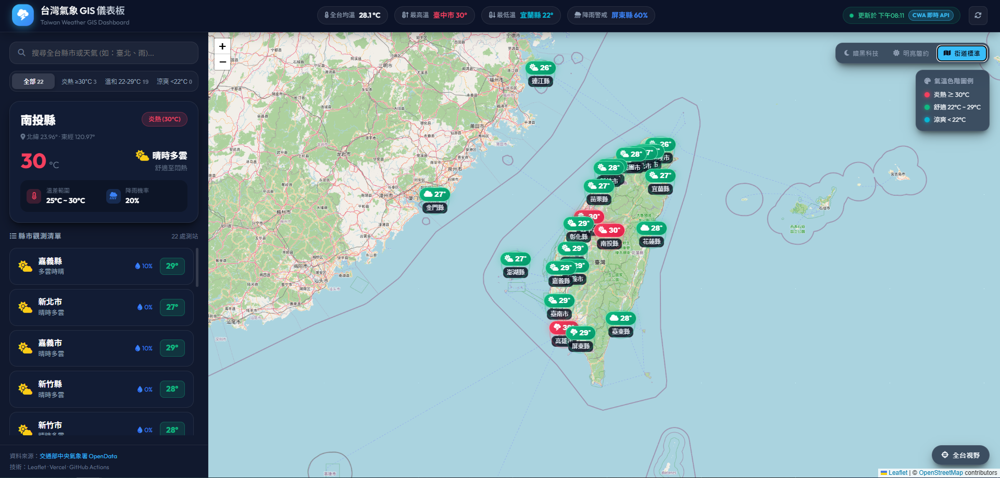

# 台灣即時氣象 GIS 觀測儀表板 (Taiwan Weather GIS Dashboard)

[](https://opensource.org/licenses/MIT)
[](https://opendata.cwa.gov.tw/)
[](https://leafletjs.com/)
[](https://vercel.com/)
[](https://github.com/features/actions)

---

### 🌐 快速傳送門 (Quick Links)
- 🔗 **GitHub Repository**：[https://github.com/Dave1588/Taiwan-weather-GIS-web-application](https://github.com/Dave1588/Taiwan-weather-GIS-web-application#readme) （點擊前往此 Repo 的 README）
- 🚀 **Live Demo 線上網站**：[https://taiwan-weather-gis-web-application-swart.vercel.app/](https://taiwan-weather-gis-web-application-swart.vercel.app/) （點擊進入網站即時查看台灣天氣）

<p align="center">
  
</p>

---

> 專為現代瀏覽器打造的**台灣氣象 GIS 互動地圖儀表板**。本專案透過定時排程向交通部中央氣象署（CWA）擷取全台 22 縣市（含外島）的即時氣象預報，利用 Serverless 靜態邊緣快取架構，搭配極致現代深色毛玻璃（Glassmorphism）與向量地圖雙向聯動體驗。

---

## 📑 目錄

- [系統架構圖 (Architecture)](#-系統架構圖-architecture)
- [核心特色 (Key Features)](#-核心特色-key-features)
- [專案目錄結構 (Directory Structure)](#-專案目錄結構-directory-structure)
- [快速開始 (Quick Start)](#-快速開始-quick-start)
- [如何驗證 CWA API Key (Verification Guide)](#-如何驗證-cwa-api-key-verification-guide)
- [雲端定時排程與 CI/CD 設定 (GitHub Actions)](#-雲端定時排程與-cicd-設定-github-actions)
- [部署至 Vercel (Deployment)](#-部署至-vercel-deployment)
- [技術棧與開源授權 (Tech Stack & Attribution)](#-技術棧與開源授權-tech-stack--attribution)

---

## 🏛️ 系統架構圖 (Architecture)

本專案採用**「無伺服器靜態前端 + CI/CD 邊緣排程 ETL」**的高效能架構：

```text
┌──────────────────────────────────────────────┐
│        中央氣象署 CWA OpenData API           │
│        (F-C0032-001 36小時氣象預報)          │
└──────────────────────┬───────────────────────┘
                       │
                       ▼  [每 3 小時自動排程請求]
┌──────────────────────────────────────────────┐
│            GitHub Actions Runner             │
│        (執行 scripts/fetch_weather.py)       │
└──────────────────────┬───────────────────────┘
                       │
                       ▼  [正規化坐標與氣象數值]
┌──────────────────────────────────────────────┐
│           public/data/weather.json           │
│            (靜態 JSON 快取資料)              │
└──────────────────────┬───────────────────────┘
                       │
                       ▼  [自動 Git Commit & Push]
┌──────────────────────────────────────────────┐
│           GitHub Repository : main           │
└──────────────────────┬───────────────────────┘
                       │
                       ▼  [自動觸發邊緣部署]
┌──────────────────────────────────────────────┐
│          Vercel Serverless Edge CDN          │
└──────────────────────┬───────────────────────┘
                       │
                       ▼  [CDN 全球高速快取提供]
┌──────────────────────────────────────────────┐
│                  使用者瀏覽器                │
│  • Leaflet.js 互動式向量地圖                 │
│  • 現代毛玻璃深色科技感 UI                   │
│  • 22 縣市動態氣溫脈衝光圈與雙向聯動         │
└──────────────────────────────────────────────┘
```

### 架構優勢
1. **零後端維護負擔**：前端完全由純靜態 HTML5 / CSS3 / ES6 構成，無須管理伺服器主機。
2. **CDN 極速載入**：所有地圖點位與氣象資訊已預先編譯為標準 GeoJSON 結構，首屏載入毫秒級回應。
3. **金鑰安全隔離**：API Key 僅存在於本機 `.env` 或 GitHub Actions Secrets，不會外洩於前端程式碼中。

---

## ✨ 核心特色 (Key Features)

### 1. 🗺️ 專業級 GIS 空間互動地圖
- **涵蓋全台 22 個行政區**：涵蓋台北至屏東本島，以及澎湖、金門、連江（馬祖）等外島測站坐標。
- **動態溫度光圈標記**：
  - 🔥 **炎熱 ($\ge 30^\circ\text{C}$)**：烈焰珊瑚紅脈衝發光波紋（`#f43f5e`）。
  - 🌿 **舒適 ($22^\circ\text{C} \sim 29^\circ\text{C}$)**：翡翠琥珀綠柔光標記（`#10b981`）。
  - ❄️ **涼爽 ($< 22^\circ\text{C}$)**：冰霜青藍霓虹標記（`#06b6d4`）。
- **多底圖即時切換**：
  - 🌑 **暗黑科技 (CartoDB Dark Matter)**：預設夜間沈浸式高對比視圖。
  - ☀️ **明亮簡約 (CartoDB Positron)**：清晰明朗的高易讀性視圖。
  - 🗺️ **街道標準 (OpenStreetMap)**：詳盡的行政區與道路細節。

### 2. ⚡ 雙向同步聯動側邊欄
- **平滑飛越聚焦 (FlyTo)**：點選側邊欄任一縣市卡片，地圖視角將以平滑動畫自動定位至該測站並彈出自訂 Popup。
- **標記反向選取**：在地圖上點選任何縣市標記，側邊欄會自動捲動至對應卡片並即時呈現該縣市溫差與降雨圓環數據。
- **全台氣象快照**：頂部即時計算並展示全台均溫、最高溫縣市、最低溫縣市、降雨機率預警。

### 3. 🔍 即時搜尋與分類篩選
- **多功能搜尋列**：支援輸入縣市名稱（如「臺北」、「高雄」）或天氣現象關鍵字（如「雨」、「晴」）即時過濾。
- **級距切換標籤**：可一鍵切換「全部」、「炎熱 ≥30°C」、「舒適 22-29°C」、「涼爽 <22°C」，地圖與列表同步過濾。

### 4. 📡 資料來源動態辨識標籤
- 頂部狀態列自帶連線狀態標籤：
  - 🟢 **`CWA 即時 API`**：確認當前數據來自氣象署即時連線。
  - 🟡 **`離線備援資料`**：於無網路或金鑰失效時自動降級顯示備援資料，保障系統 100% 可用性。

---

## 📂 專案目錄結構 (Directory Structure)

```text
Taiwan-weather-GIS-web-application/
├── .github/
│   └── workflows/
│       └── update-weather.yml     # GitHub Actions 定時排程（每 3 小時更新一次）
├── scripts/
│   └── fetch_weather.py           # Python 氣象 ETL 擷取與坐標計算核心腳本
├── public/                        # Vercel 部署根目錄（純靜態）
│   ├── css/
│   │   └── style.css              # 現代深色科技感樣式（Glassmorphism、微動畫）
│   ├── js/
│   │   └── app.js                 # Leaflet GIS 互動邏輯、底圖切換與雙向聯動
│   ├── data/
│   │   └── weather.json           # 全台 22 縣市快取氣象資料 JSON
│   └── index.html                 # 主儀表板 UI
├── .env.example                   # 環境變數範例檔
├── .gitignore                     # Git 忽略清單（排除 .env 與暫存檔）
├── .vercelignore                  # Vercel 部署排除清單（確保作為純靜態網站發布）
├── vercel.json                    # Vercel 發布與乾淨路徑配置
├── requirements.txt               # Python 依賴包設定
├── README.md                      # 本專案說明文件
└── taiwan_weather_gis_design_document.md # 初始架構設計規格書
```

---

## 🚀 快速開始 (Quick Start)

### 1. 複製儲存庫
```bash
git clone https://github.com/Dave1588/Taiwan-weather-GIS-web-application.git
cd Taiwan-weather-GIS-web-application
```

### 2. 本機環境設定 (選用)
複製 `.env.example` 為 `.env` 並填入您的 CWA API Key：
```bash
cp .env.example .env
```
在 `.env` 中設定：
```env
CWA_API_KEY=您的_CWA_API_金鑰
```
> 若無 API Key，腳本會自動使用完整 22 縣市的預設氣象資料，確保本機開發不受阻礙。

### 3. 執行氣象資料更新
```bash
python scripts/fetch_weather.py
```
執行成功後，將會產出格式化的最新氣象數據至 `public/data/weather.json`。

### 4. 啟動本機預覽伺服器
```bash
# 使用 Python 內建伺服器
python -m http.server 8080 --directory public
```
開啟瀏覽器訪問：[http://localhost:8080](http://localhost:8080) 即可開始操作。

---

## 🔍 如何驗證 CWA API Key (Verification Guide)

若想確認氣象署金鑰是否有正確生效，可透過以下 **4 種方式** 驗證：

### 方法 1：查看網頁右上角的狀態徽章
打開網頁右上角，狀態列包含即時辨識燈號：
- 🟢 **亮藍色 `[ CWA 即時 API ]`**：代表前端所載入的資料是由氣象署官方 API 抓取的最新數據。
- 🟡 **黃色 `[ 離線備援資料 ]`**：代表目前運作於備援模式。

### 方法 2：檢查 `weather.json` 中的來源欄位
檢視 `public/data/weather.json` 標頭：
```json
{
  "updated_at": "2026-09-21T12:11:12.973617+00:00",
  "source": "CWA OpenData Live API",
  "count": 22,
  ...
}
```
欄位顯示 `"source": "CWA OpenData Live API"` 即為成功連線。

### 方法 3：本機指令直接連線測試
在終端機執行下列 Python 測試指令：
```bash
python -c "
import urllib.request, json, ssl
ctx = ssl._create_unverified_context()
url = 'https://opendata.cwa.gov.tw/api/v1/rest/datastore/F-C0032-001?Authorization=您的金鑰&format=JSON'
req = urllib.request.Request(url, headers={'User-Agent': 'Taiwan-Weather-GIS/1.0'})
with urllib.request.urlopen(req, context=ctx) as r:
    data = json.loads(r.read().decode('utf-8'))
print('CWA 回應狀態:', data.get('success'))
print('取得測站數:', len(data.get('records', {}).get('location', [])))
"
```
回傳 `CWA 回應狀態: true` 且 `取得測站數: 22` 即代表金鑰有效。

### 方法 4：查看 GitHub Actions 執行日誌
GitHub Actions 執行時，工作流日誌中會清楚印出：
```text
[*] Fetching live data from CWA API (Key: CWA-55***)...
[+] Successfully fetched 22 locations from CWA.
[OK] Weather payload successfully written to public/data/weather.json
```

---

## ⚙️ 雲端定時排程與 CI/CD 設定 (GitHub Actions)

專案已內建 `.github/workflows/update-weather.yml`，每 3 小時會自動向氣象署拉取最新氣象數據並推送回儲存庫。

### 設定 GitHub Repository Secrets：
1. 開啟您的 GitHub 儲存庫。
2. 前往 **Settings** > **Secrets and variables** > **Actions**。
3. 點擊 **New repository secret**：
   - **Name**: `CWA_API_KEY`
   - **Secret**: 貼上您的氣象署 API 金鑰（例如：`CWA-XXXXXXXX-XXXX-XXXX-XXXX-XXXXXXXXXXXX`）。
4. 儲存後，前往 **Actions** 標籤頁即可手動測試 `Update Weather Data` 工作流。

---

## 🌐 部署至 Vercel (Deployment)

本專案經過特殊最佳化，已透過 `.vercelignore` 排除 Python 後端誤判，支援於 Vercel 純靜態秒速發布：

1. 登入 [Vercel](https://vercel.com/)。
2. 點擊 **Add New Project**，匯入 `Taiwan-weather-GIS-web-application` 儲存庫。
3. Vercel 會自動讀取專案內的 `vercel.json`：
   - `outputDirectory`: `"public"`
   - `cleanUrls`: `true`
4. 點選 **Deploy**，約 15 秒內即可完成全球 CDN 發布！

---

## 🛠️ 技術棧與開源授權 (Tech Stack & Attribution)

- **前端技術**：HTML5, Vanilla CSS3 (Custom Glassmorphism), Modern ES6 JavaScript
- **GIS 地圖引擎**：[Leaflet.js 1.9.4](https://leafletjs.com/)
- **字型與圖標**：[Outfit](https://fonts.google.com/specimen/Outfit), [Noto Sans TC](https://fonts.google.com/specimen/Noto+Sans+TC), [FontAwesome 6](https://fontawesome.com/)
- **地圖底圖**：[CartoDB](https://carto.com/) Dark Matter / Positron、[OpenStreetMap](https://www.openstreetmap.org/)
- **氣象資料來源**：[交通部中央氣象署開放資料平臺 (CWA OpenData)](https://opendata.cwa.gov.tw/)，依政府資料開放授權條款釋出。
- **授權條款**：本專案採用 [MIT License](LICENSE) 開源授權。